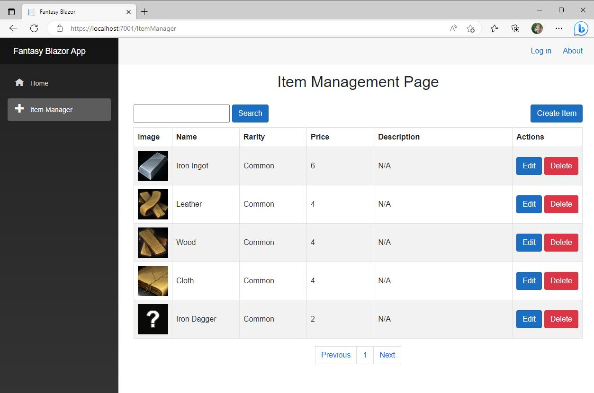

# Fantasy-Web-App
[Work In Progress] A portoflio Project that i'm working on that utilizes ASP.NET Core Web API &amp; Blazor. The finished project will be a fantasy inspired crafting web game with user accounts and a passwordless email jwt auth system. For now the project is only a CRUD App with incomplete custom authentication in the Web API Project.

An example image of what the current item manager looks like, it will eventually be used to manage a users inventory. 

